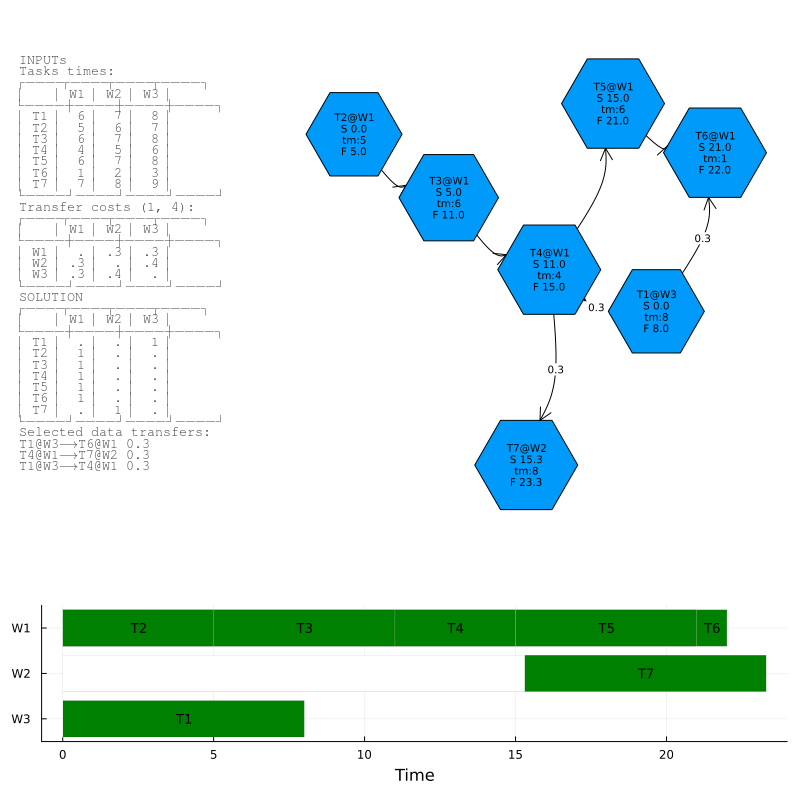

### DagScheduler
by Przemyslaw Szufel & Julian Samaroo

A library for optimal planning of tasks in a directed acyclic graph (DAG) with dependencies.
The library takes into consideration heterogenous distributed environment, where tasks are executed on multiple workers. The library takes into consideration heterogenous data transfer times between workers and tasks.

Sample usage (see demo.jl for more details):
```julia
using DagScheduler, Random
Random.seed!(123)

g, c, γ = generate_test_problem(K=7,p=0.35);

times, assignW, penalties, dfloads, execution_time = solve(g, c, γ);

push!(LOAD_PATH, joinpath(dirname(pathof(DagScheduler)), "..", "lib", "DagSchedulerViz"))
using DagSchedulerViz

plot_solution_report(g, c, γ, times, assignW, penalties, dfloads)
```



# Mathematical Formulation of the MILP Model for the DAG Scheduler

## Variables:

- $ t_k \geq 0 $: Start time of each task $ k $, for $ k = 1, \ldots, K $.
- $ t^* \geq 0 $: End time of the last task.
- $ s_{kw} \in \{0,1\} $: Binary variable that is 1 if task $ k $ is assigned to worker $ w $, for $ w = 1, \ldots, W $.
- $ p_{kl} \geq 0 $: Penalties for moving between workers, applicable for task pairs $(k, l) $ (edges in the DAG).

## Objective:

Minimize the following expression:
$ \min Z \cdot t^* + \sum_{k=1}^K t_k + \sum_{(k,l) \in a_{kls}} p_{kl} $
