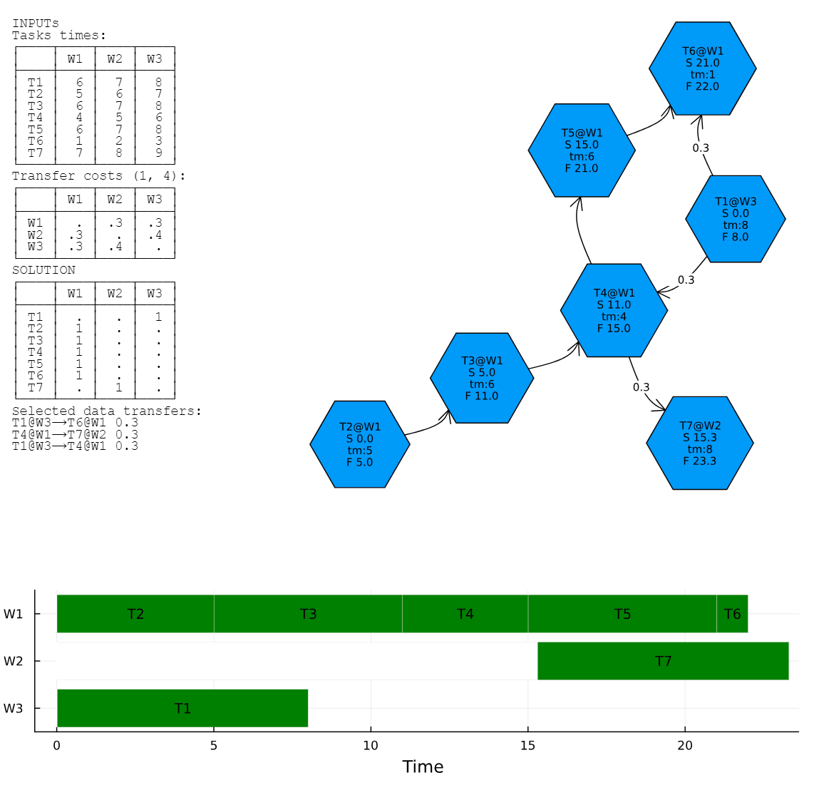

### DagScheduler

Involved people:
- Przemyslaw Szufel
- Julian Samaroo


[Discussion - planning Przemyslaw Szufel & Guillaume Dalle](notes.md)


A WIP library for optimal planning of tasks in a directed acyclic graph (DAG) with dependencies.
The library takes into consideration heterogenous distributed environment, where tasks are executed on multiple workers. The library takes into consideration heterogenous data transfer times between workers and tasks.

Sample usage (see demo.jl for more details):
```julia
using DagScheduler, Random
Random.seed!(123)

g, c, γ = generate_test_problem(K=7,p=0.35);

times, assignW, penalties, dfloads, execution_time = solve(g, c, γ);

push!(LOAD_PATH, joinpath(dirname(pathof(DagScheduler)), "..", "lib", "DagSchedulerViz"))
using DagSchedulerViz

plot_solution_report(g, c, γ, times, assignW, penalties, dfloads)
```



# Mathematical Formulation of the MILP Model for the DAG Scheduler

## Parameters:

- $` k = 1,\ldots,K `$: $` K `$ jobs to be executed within the schedule 
- $` \gamma_{kl} \geq 0 `$: Penalties for moving between workers, applicable for task pairs $`(k, l)`$ (edges in the DAG).
- $` c_{kw} \geq 0 `$:  a matrix with the times required to complete task $` k `$ on worker $` w `$
- $` Z `$: a factor for the importance of the total execution time in the optimization model
- $` M `$: so called "big-M" - a large M number in the optimization model. Should be larger than the maximum possible execution time of the entire DAG
 
## Decision Variables:

- $` t_k \geq 0 `$: Start time of each task $k$, for $` k = 1,\ldots,K `$.
- $` t^{*} \geq 0 `$: End time of the last task.
- $` s_{kw} \in \{0,1\} `$: Binary variable that is 1 if task $` k `$ is assigned to worker $` w `$, for $` w = 1,\ldots,W `$.
- $` p_{kl} \geq 0 `$: Applied penalties for moving between workers, applicable for task pairs $`(k, l)`$ (edges in the DAG).
  
## Objective:

Minimize the following expression:
```math
\min Z \cdot t^{*} + \sum_{k=1}^K t_k + \sum_{(k,l) edges(g)} p_{kl}
```


## Constraints:

1. **Assignment Constraint:** Each task is assigned to exactly one worker:

```math
    \sum_{w=1}^W s_{kw} = 1 \qquad \forall k = 1,\ldots,K
```

2. **Task Timing and Penalties:**

```math
    t_k + \sum_{w=1}^W c_{kw} s_{kw} + p_{kl} \leq t_l \qquad \forall (k, l) \in edges(g)
```
```math
    p_{kl} \geq (s_{kw_1} + s_{lw_2} - 1) \cdot \gamma^{(k,l)}_{w_1,w_2} \qquad \forall (k, l) \in edges(g); \forall w_1 \neq w_2
```


3. **Last Task Timing:**

```math
    t_l + \sum_{w=1}^W c_{lw} s_{lw} \leq t^{*} \qquad \forall l : \text{outdegree}(l) = 0
```

4. **Sequential Task Execution:** If tasks $` k `$ and $` l `$ share the same worker, the task $` l`$ occurs after task $` k `$:

```math
    t_k + \sum_{w=1}^W c_{kw} s_{kw} \leq t_l + M \cdot (2 - s_{kw} - s_{lw}) \qquad \forall l > k
```


#  Extended MILP Model for the DAG Scheduler - includes parallel utilization of resources available at computing units

In this formulation we are using computing units (CU) which are more like nodes or GPU accelarators. 

A computing unit can run several tasks in parallel. A computing unit can be very heterogenous. CU can be either a CPU with RAM and disk space or a  GPU with video RAM.

A computing unit $` w `$  can be shared across many tasks executed in paraller as long as there are free computing resources available for those tasks.
A  computing resource $` r `$, $` r = 1,\ldots,R `$ can be, for an example, the amount of CPU cores, RAM or disk space.

A computing unit $` w `$ has some number of avaialble resources $` h_w^{(r)} `$. On the other hand a task $` k `$ has a copmpute-unit-specific resource requirement $` g_{kw}^{(r)} `$.

At any time point $` T_u `$ a task $` k `$ can be allocated to a computing unit when the amount of total allocated resources on that computing unit does not exceed the amount of available resources.

## Parameters:

- $` k = 1,\ldots,K `$: $` K `$ tasks to be executed within the schedule 
- $` \gamma^{(k,l)}_{w_1,w_2} \geq 0 `$: Penalties for moving between computing units, applicable for task pairs $`(k, l)`$ (edges in the DAG).
- $` c_{kw} \geq 0 `$:  a matrix with the times required to complete task $` k `$ on computing unit $` w `$
- $` g_{kw}^{(r)} `$: amount of resource  $` r `$ required to execute task $` k `$ on computing unit $` w `$
- $` h_w^{(r)} `$: total quantity of resource  $` r `$ available on computing unit $` w `$ (could be RAM or CPU)
- $` Z `$: a factor for the importance of the total execution time in the optimization model
- $` M `$: so called "big-M" - a large M number in the optimization model. Should be larger than the maximum possible execution time of the entire DAG
 
## Decision Variables:

- $` t_k \geq 0 `$: Start time of each task $k$, for $` k = 1,\ldots,K `$.
- $` s_{kw} \in \{0,1\} `$: Binary variable that is 1 if task $` k `$ is assigned to computing unit $` w `$, for $` w = 1,\ldots,W `$.
- $` p_{kl} \geq 0 `$: Applied penalties for moving between computing units, applicable for task pairs $`(k, l)`$ (edges in the DAG).
- $` T_u =  T_1, T_2,\ldots,T_{2K}  `$: time intervals $` T_u \geq 0 `$, $` 0 \leq T_1 \leq T_2 \leq\ldots\leq T_{2K}  `$:
- $` b_{ku} \in \{0,1\} `$: the task $` k `$ begins with the time interval $` u `$, $` u = 1,\ldots,2K-1 `$
- $` f_{ku} \in \{0,1\} `$: the task $` k `$ finishes with the time interval $` u `$, $` u = 2,\ldots,2K `$
- $` e_{ku} \in \{0,1\} `$: the task $` k `$ executes within the time interval $` u `$ onwards, $` u = 1,\ldots,2K-1 `$
- $` E_{kuw} \in \{0,1\} `$: the task $` k `$ executes within the time interval $` u `$ onwards on the computing unit $` w `$ 

## Objective:

Minimize the following expression:
```math
\min Z \cdot T_{2K} + \sum_{(k,l) edges(g)} p_{kl}
```
This function has two components: the total time to complete all tasks and total time penalties for copying around the data (if we want to avoild copying regardless of the total execution time).


## Constraints:

1. **Timing constraint:** beginning of tasks are assigned to appropiate intervals:
```math
   T_u \geq t_k - (1-b_{ku})M \qquad \forall k = 1,\ldots,K; \forall u = 1,\ldots,2K-1
```
```math
   T_u \leq t_k + (1-b_{ku})M \qquad \forall k = 1,\ldots,K; \forall u = 1,\ldots,2K-1
```

2. **Timing constraint:** finishing points of tasks are assigned to appropiate intervals:
```math
   T_u \geq t_k + \sum_{w=1}^W c_{kw} s_{kw} + p_{kl} - (1-f_{ku})M \qquad \forall k = 1,\ldots,K; \forall u = 2,\ldots,2K
```
```math
   T_u \leq t_k + \sum_{w=1}^W c_{kw} s_{kw} + p_{kl} + (1-f_{ku})M \qquad \forall k = 1,\ldots,K; \forall u = 2,\ldots,2K
```

3. **Interval assignment:** Each task $` k `$ has the begining and finishing times attached to one interval
```math
   \sum_{u=1}^{2K-1} b_{ku} = 1 \qquad \forall k = 1,\ldots,K
```
```math
   \sum_{u=2}^{2K} f_{ku} = 1 \qquad \forall k = 1,\ldots,K
```

4. **Interval occupancy:** Task $` k `$'s execution occupies a given interval from the beginning to the finish (finish excluded)
   
```math
   e_{ku} \geq b_{ku} \qquad \forall k = 1,\ldots,K; \forall u = 1,\ldots,2K-1
```
```math
   e_{ku} \geq e_{k,u-1} - f_{ku} \qquad \forall k = 1,\ldots,K; \forall u = 2,\ldots,2K
```
5. **computing unit availability:** Starting from interval $` u `$ computing unit utilization cannot exceed available resources
```math
   E_{kuw} \geq  e_{ku} + s_{kw} - 1  \qquad \forall k = 1,\ldots,K; \forall u = 1,\ldots,2K-1; \forall w = 1,\ldots,W
```

```math
   \sum_{k=1}^{K} E_{kuw} \cdot g_{kw}^{(r)}    \leq h_w^{(r)}  \qquad \forall u = 1,\ldots,2K-1; \forall w = 1,\ldots,W; \forall r = 1,\ldots,R
```

6. **Switching time penalty**: Time $` p_{kl} `$ applied then connected tasks are executed on different computing units
```math
    p_{kl} \geq (s_{kw_1} + s_{lw_2} - 1) \cdot \gamma^{(k,l)}_{w_1,w_2} \qquad \forall (k, l) \in edges(g); \forall w_1 \neq w_2
```
 
 
7. **Task timing sequence:** corresponing the DAG graph `g` and taking considaration of switching penalty
```math
    t_k + \sum_{w=1}^W c_{kw} s_{kw} + p_{kl} \leq t_l \qquad \forall (k, l) \in edges(g)
```
